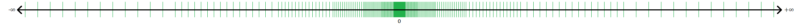

# Floating point arithmetic

In the following, we explore how computers represent numbers. Integers are the simplest to understand. A computer can only represent a finite range of integers, for example, some implementations can store integers between $-2^{63} = -9223372036854775808$ and $2^{63}-1 = 9223372036854775807$.

Next, consider rational numbers such as $1/3 = 0.33333\ldots$. One might attempt to work directly with fractional expressions like $1/3$ and keep track of numerators and denominators. However, the number of digits in both the numerator and denominator tends to grow significantly as computations progress, making this approach impractical in most cases. Real numbers such as $\pi$ or $e$ pose an even greater challenge because they cannot be represented as fractions of integers.

The solution for $\mathbb{Q}$ and $\mathbb{R}$ is the same: we must truncate their representation after a finite number of digits, thereby introducing a small error. Complex numbers, in terms of their storage in computer memory, are treated like two real numbers.

## Definition of Floating Point Numbers

The basic idea behind floating point numbers is to define a finite subset of $\mathbb{Q}$ that has a finer spacing for small numbers, allowing computations to account for small quantities, while employing a wider spacing for large numbers, thus covering a large range between the smallest and largest represented numbers.

```{prf:definition}
We call $\mathcal{F}$ a set of floating point numbers if

$$
\mathcal{F} = \{ 0 \} \cup \left\{(-1)^s\cdot b^e \cdot \frac{m}{b^{p-1}} :\right. \left. s \in \{ 0,1\}; e_{min}\leq e \leq e_{max}; b^{p-1}\leq m\leq b^{p}-1\right\}.
$$

for some $b, p \in \{2, 3, 4, \ldots\}$ and $e_\min, e_\max \in \mathbb{Z}$ with $e_\min < e_\max$.
```

The above rigorous definition of floating point numbers allows us to prove theorems that consider that computers only support finite precision arithmetic.

The definition already indicates how the numbers of $\mathcal{F}$ are best represented in the base-$b$ numerical system. Most commonly, we look at binary numbers, i.e., base $b = 2$, and sometimes at decimal numbers, i.e., base $b = 10$. The factor $(-1)^s$ determines the sign of the number. The factor $b^e$ determines the position of the leading digit. The final factor $\frac{m}{b^{p-1}}$ takes values between $1 = b^{p-1} / b^{p-1}$ and $(b^{p}-1) / b^{p-1} = b - 1 / b^{p-1}$. For large $p$, we find $b \approx (b^{p}-1) / b^{p-1}$. Thus, varying the mantissa $m$ allows us to approximate different numbers, whose leading digit is in the same position:

$$
\frac{m}{b^{p-1}} = 1, 1+b^{1-p}, 1+2b^{1-p}, \dots, b-b^{1-p}
$$

````{prf:example}
Let $b = 2$, $p = 2$, $e_\min = -1$ and $e_\max = 1$. It follows that $b^{p-1} = 2$ and $b^p - 1 = 3$. Then $\mathcal{F}$ consists of $0$ and the numbers enumerated in the following table:

```{table} Non-zero Floating Point Numbers
| $s$ | $e$  | $m$ | Value |
|-----|------|-----|-------|
| 0   | -1   | 2   | $2^{-1} \cdot \frac{2}{2^1} = 0.5$ |
| 0   | -1   | 3   | $2^{-1} \cdot \frac{3}{2^1} = 0.75$ |
| 0   | 0    | 2   | $2^0 \cdot \frac{2}{2^1} = 1$ |
| 0   | 0    | 3   | $2^0 \cdot \frac{3}{2^1} = 1.5$ |
| 0   | 1    | 2   | $2^1 \cdot \frac{2}{2^1} = 2$ |
| 0   | 1    | 3   | $2^1 \cdot \frac{3}{2^1} = 3$ |
| 1   | -1   | 2   | $-2^{-1} \cdot \frac{2}{2^1} = -0.5$ |
| 1   | -1   | 3   | $-2^{-1} \cdot \frac{3}{2^1} = -0.75$ |
| 1   | 0    | 2   | $-2^0 \cdot \frac{2}{2^1} = -1$ |
| 1   | 0    | 3   | $-2^0 \cdot \frac{3}{2^1} = -1.5$ |
| 1   | 1    | 2   | $-2^1 \cdot \frac{2}{2^1} = -2$ |
| 1   | 1    | 3   | $-2^1 \cdot \frac{3}{2^1} = -3$ |
```
````

A graphical representation ([Source Wikipedia](https://en.wikipedia.org/wiki/Floating-point_arithmetic)) of a floating point set is



Often we call abreviate floating point numbers as floats.

## IEEE 754

The previous example is not practical because that $\mathcal{F}$ is far too small. Instead, the most widely used floating point sets are defined in the [IEEE 754 standard](https://ieeexplore.ieee.org/document/8766229).

The two most common types of floating-point numbers are IEEE double precision and IEEE single precision. The former provides around 15 digits of accuracy, while the latter offers around 7 digits of accuracy.

* **IEEE double precision:** $e_{min} = -1022, e_{max} = 1023, p = 53$, $b = 2$
* **IEEE single precision:** $e_{min} = -126, e_{max} = 127, p = 24$, $b = 2$

For almost all purposes, this is more than sufficient. Take, for example, the gravitational constant $G$. It is known to around 4 digits of accuracy, only a fraction of the number of digits available in modern computers.

For most numerical calculations, double precision is preferred. The reason is that in some computations, errors might accumulate, leading to a loss of accuracy. In double precision, we have much more headroom for this than in single precision.

However, not all applications require such precision. For example, many machine learning applications use the half-precision type, which is even less accurate than single precision but can be evaluated extremely efficiently on dedicated hardware, e.g., tensor cores on modern machine learning accelerators.

## Floating Point Arithmetic

The distance between neighbouring floats with same leading digit is $2^e b^{1-p}$. Let $x \in [b^{e_{min}}, b^{e_{max}+1}]$, i.e. be a real number between the smallest and largest float. Define $\epsilon_{mach} := \frac{1}{2} b^{1-p}$. There exists $x' \in \mathcal{F}$ such that $|x - x'| \leq \epsilon_{mach} |x|$. **In words, $\epsilon_{mach}$ is the relative distance to the next floating point number in $\mathcal{F}$.**

Define the projection

$$
fl: x \rightarrow fl(x),
$$

where $fl(x)$ is the closest floating point number in $\mathcal{F}$. If there are two floating point numbers of equal distance choose the one with smaller absolute value. It follows that $fl(x) = x \cdot (1 + \epsilon)$ for some $|\epsilon| \leq \epsilon_{mach}$.

```{prf:theorem} Fundamental Theorem of Floating Point Arithmetic
Define $x\odot y = fl(x \cdot y)$, where $\cdot$ is one of $+,-,\times,\div$. Then for all $x,y\in\mathcal{F}$ there exists $\epsilon$ with $|\epsilon| \leq \epsilon_{mach}$ such that

$$ 
x\odot y = (x \cdot y)(1+\epsilon).
$$
```

Most modern computer architectures follow the mathematical assumptions on floating point set to guarantee the Fundamental Theorem. For additional details we refer to the recommended lecture book {cite}`TrefethenBau`.

## Python Skills

The Numpy module provides convenient tools to query the properties of floating point numbers. First, import Numpy as follows:

```python
import numpy as np  # Import the numpy extension module and alias it as np
```

### Floating Point Data Types in Numpy

Numpy defines the following data types for floating point numbers:

* **IEEE double precision**: `np.float`, `np.double`, `np.float64`

* **IEEE single precision**: `np.single`, `np.float32`

### Querying Floating Point Properties

Use `np.finfo` to query floating point properties. For example:

```python
double_precision_info = np.finfo(np.float64)
```

Key properties of double precision floating point numbers:

* **Maximum value**: `double_precision_info.max`

* **Smallest (absolute) normalized value**: `double_precision_info.tiny`
* **Smallest relative difference (machine epsilon)**: `double_precision_info.eps`

* **Approximate relative precision**: `double_precision_info.precision`

Illustrative examples:

```python
1 + double_precision_info.eps  # Just larger than 1
1 + 0.25 * double_precision_info.eps  # Slightly closer to 1
```

### Special Floating Point Values

The floating point standard also defines:

* `NaN`: Not a number
* `inf`: Infinity

Examples:

```python
a = np.inf
b = np.float64(0) / np.float64(0)  # Produces NaN
print(b)  # Output: nan
```

> **Note**: Numpy adheres to the IEEE 754 standard, so operations like division by zero return `NaN` rather than raising an error.

Python itself is not fully IEEE 754 compliant. Consider:

```python
a = np.inf
b = 0. / 0.  # Raises ZeroDivisionError in Python
```

This behaviour is one reason why Numpy is critical for numerical computations in Python, as it adheres more closely to the IEEE 754 standard.

## Self-check Questions

````{admonition} **Question**
:class: tip
Explain the meaning of $\epsilon_{mach}$.
````

````{dropdown} **Answer**
$\epsilon_{mach}$, known as machine epsilon, is defined as:

$$
\epsilon_{mach} = \frac{1}{2}b^{1-p},
$$

where $b$ is the base and $p$ is the precision. It represents half the distance from 1 to the next floating point number and quantifies the maximum relative error between a real number $x$ and its closest floating point representation $x'$. Mathematically:

$$
|x - x'| \leq |x| \epsilon_{mach}.
$$
````

````{admonition} **Question**
:class: tip
Why do double precision numbers give you around 15 digits of accuracy?
````

````{dropdown} **Answer**
In double precision, we have:

$$
\epsilon_{mach} = 2^{-53} \approx 1.11 \times 10^{-16}.
$$

This means the relative error when mapping a real number to its floating point representation is accurate to approximately 15 significant digits.
````
