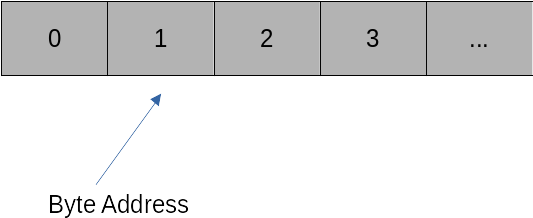

# Memory layout and Numpy

## Memory layouts

We can imagine memory as a linear collection of consecutive memory addresses, each representing one byte.



The key to efficient data representation is to order data spatially local in memory. This means the data we want to work on next should be as close to our current data as possible. The reason is that memory accesses in modern computers are extremely expensive compared to actual computations. To alleviate this problem, all modern CPUs rely on sophisticated caches that try to read data from memory ahead of time. This works only if the next pieces of data are close to the data that we are currently working on.

Standard Python list types do not guarantee this locality. List elements can be at very different memory addresses, making standard lists and other base Python types unsuitable for numerical operations. We require a buffer type that guarantees us a chunk of consecutive addresses in the system memory.

What happens if we have a matrix? Consider a 2 x 2 matrix:

$$
A = \begin{pmatrix} 1 & 2\\ 3 & 4\end{pmatrix}
$$

We have two ways of ordering this matrix across the memory band:

* **C-Style ordering:** This aligns the matrix row by row in memory. Hence, our memory buffer will have four elements that read:

$$
1, 2, 3, 4
$$

* **Fortran-Style ordering:** This aligns the matrix column by column in memory. Our memory buffer will now have four elements that read:

$$
1, 3, 2, 4
$$

Both memory layout styles are used across scientific computing, and it is important to know the assumed layout in a given numerical library. Ignoring data layouts leads to inefficiency if code has to translate on the fly between the layouts, or even bugs if a library ignores the layout differences.

## Numpy to the rescue

[Numpy](https://numpy.org/) addresses these issues by providing an array type that reserves consecutive chunks of memory and allows the user to transparently map data onto this memory, either using C-style ordering (default) or Fortran-style ordering (optional). Numpy also ensures that operations between arrays of different orderings are executed correctly (although it is best to avoid this). Numpy has long established itself as the de facto standard for array types in Python. Indeed, many other libraries have adopted the Numpy syntax and conventions to ensure their data types interoperate seamlessly with Numpy.

**Numpy is a major reason for the significant success of Python.**

Recently, an associated [Numpy paper](https://www.nature.com/articles/s41586-020-2649-2) was published in Nature, which is quite rare for a software library and demonstrates how fundamental Numpy has become to any science that relies on data processing. Most of these operations are implemented by calling natively into accelerated BLAS/Lapack functions.

## BLAS and Lapack

[BLAS (Basic Linear Algebra Subroutines)](http://www.netlib.org/blas/) defines a set of interfaces to standard linear algebra functions. There are three BLAS variants: Level 1, 2, and 3.

* BLAS Level 1 defines functions that require $O(n)$ computational complexity ($n$ is the number of elements), such as vector addition, multiplication with scalars, or dot products.
* BLAS Level 2 defines functions that require $O(n^2)$ computational complexity, such as matrix-vector products or triangular solves.
* BLAS Level 3 defines functions that require $O(n^3)$ computational complexity, of which the most important one is the matrix-matrix product.

A reference BLAS implementation exists from <http://www.netlib.org>. However, this should never be used in practice. The key to fast BLAS operations is implementations that optimally use the CPU cache architecture to minimise data transfer delays. Several BLAS libraries exist that are optimised for modern CPUs and not only exploit caching but also SIMD acceleration and multi-core processing. Examples of such libraries are [Intel MKL](https://software.intel.com/content/www/us/en/develop/tools/math-kernel-library.html), [OpenBLAS](https://www.openblas.net/), or [BLIS](https://github.com/flame/blis).

[Lapack](http://netlib.org/lapack) is a library of advanced linear algebra functions such as linear system solves, eigenvalue problems, singular values, least-squares problems, etc., using BLAS. Lapack routines are highly optimised to use matrix-matrix Level-3 BLAS operations whenever possible. The reason is memory efficiency. The ratio of computational complexity to memory complexity for matrix-matrix products is $O(n^3)$ to $O(n^2)$. Hence, for larger problems, we have far more operations than memory accesses, which is desirable as memory accesses are slow.

Numpy links against available BLAS and Lapack libraries to ensure the most efficient implementations of linear algebra operations. If Numpy is installed from conda-forge, then by default, the OpenBLAS library is used. Alternatively, one can also use Intel MKL.

## Python skills

We already know that Numpy is a fundamental library for scientific computing in Python. Here's a quick introduction to its basic features and functionality. To use Numpy, import it as follows:

```python
import numpy as np
```

### Creating Arrays

The basic data type in Numpy is the array. Here are some examples of how to create arrays:

```python
# A double-precision array with three entries
a = np.array([3.5, 4, 18.1], dtype='float64')

# Random array with 10 components
a_random = np.random.rand(10)

# A 10x10 matrix of ones, stored as double precision
a_ones = np.ones((10, 10), dtype='float64')

# A complex 3D tensor with all entries set to zero
a_zeros = np.zeros((10, 10, 10), dtype='complex128')

# An uninitialized byte array that can store 50 bytes
a_empty = np.empty(50, dtype='byte')

# The first 50 integers, starting at 0
a_range = np.arange(50)
```

### Accessing Array Properties

You can easily access the shape of an array:

```python
print(a_range.shape)  # (50,)
print(a_zeros.shape)  # (10, 10, 10)
```

### Accessing Elements

Accessing elements of arrays is straightforward:

```python
# Access the first element
a_random[0]

# Access the first two elements
a_random[:2]

# Access the last two elements
a_random[-2:]

# Access a submatrix (third to fifth column in the first three rows)
a_ones[:3, 2:5]

# Access an element in a multidimensional array
a_zeros[3, 2, 1]
```

### Modifying Arrays

You can also modify elements of arrays:

```python
# Set a specific element
a_ones[3, 3] = 10

# Set a column to a range of values
a_ones[:, 4] = np.arange(10)

# Set an entire row to a specific value
a_ones[8] = 10
```

### Plotting with Numpy and Matplotlib

Together with Matplotlib, you can easily plot data:

```python
from matplotlib import pyplot as plt

x = np.linspace(-10, 10, 10000)
y = np.exp(-x**2)

plt.plot(x, y)
plt.xlabel('x')
plt.ylabel('exp(-x^2)')
plt.show()
```

### Matrix Operations

Matrix and vector operations in Numpy include:

```python
# Generate random matrices
A = np.random.randn(100, 100)
B = np.random.randn(100, 100)

# Matrix/matrix product
C = A @ B

# Componentwise product
C_elementwise = A * B
```

### Solving Linear Systems

Numpy can solve linear systems of equations:

```python
A = np.random.rand(1000, 1000)
b = np.random.rand(1000)

# Solve Ax = b
x = np.linalg.solve(A, b)

# Compute the relative residual
residual = np.linalg.norm(b - A @ x) / (np.linalg.norm(A) * np.linalg.norm(x) + np.linalg.norm(b))
print(residual)
```

This computation demonstrates solving a system with accuracy close to machine precision.

### Further Resources

For a more comprehensive introduction, refer to the [Numpy user guide](https://numpy.org/doc/stable/user/index.html).
