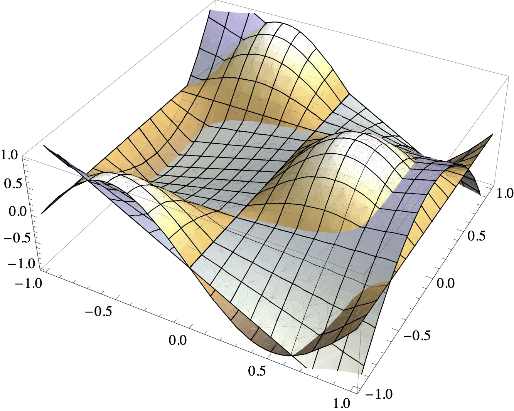

# Least-squares Problems

Least-squares problems occur in optimisation, data fitting and other fields of the mathematical sciences.

Consider a matrix $A \in \mathbb{R}^{m \times n}$ and a vector $a \in \mathbb{R}^m$. The central idea of the least-squares problem is to find a vector $\hat{x} \in \mathbb{R}^n$ that minimises the Euclidean norm (or $2$-norm) of the residual vector $Ax - a$. This problem is formulated as

$$
\hat{x} \in \text{arg}\min_{x \in \mathbb{R}^n} \|Ax - a\|_2.
$$

Here $\text{arg}\min_{x \in \mathbb{R}^n} \|Ax - a\|_2$ is the set of all $x$ which minimise $\|Ax - a\|_2$. If the minimiser is unique, we also write (with a slight abuse of notation)

$$
\hat{x} = \text{arg}\min_{x \in \mathbb{R}^n} \|Ax - a\|_2.
$$

Thus, in the least-squares sense, the optimisation problem generalises the concept of the solution to a system of linear equations: if $A$ is invertible, then $A \hat{x} = a$. If $A$ is overdetermined, then $\hat{x}$ aims to minimise the amount by which $A \hat{x}$ fails to achieve equality with $a$.

## The normal equation

The identity

$$
A^\top A\hat{x} = A^\top a.
$$

is called the normal equation of the least-squares problem.

```{prf:theorem} Normal equation of least-squares approximations
Let $A \in \mathbb{R}^{m \times n}$, $a \in \mathbb{R}^m$. Then

$$
\hat{x} \in \text{arg}\min_{x \in \mathbb{R}^n} \|Ax - a\|_2.
$$

if and only if $\hat{x}$ satisfies the normal equation.
```

```{prf:proof}
The vector $\hat{x}$ minimises the least-squares problem if and only if for all $\epsilon\in\mathbb{R}^n$:

$$
\begin{aligned}
\|A\hat{x} -a \|_2^2 
& \leq \|A(\hat{x} + \epsilon) - a\|_2^2 = \left[A(\hat{x} + \epsilon) - a\right]^\top\left[A(\hat{x} + \epsilon) - a\right]\\
&= \|A\hat{x} -a \|_2^2+2 \epsilon^\top(A^\top A\hat{x} - A^\top a) + \epsilon^\top A^\top A\epsilon
\end{aligned}
$$

*Step 1:* Suppose that $\hat{x}$ does not satisfy the normal equation. Then $\| A^\top A\hat{x} - A^\top a \|_2 > 0$. Suppose that $\hat{x}$ minimises the least-squares problem. With $\epsilon := \delta (A^\top A\hat{x} - A^\top a)$, $\delta \in \mathbb{R}$, the above implies

$$
0 \leq 2 \delta \, \| A^\top A\hat{x} - A^\top a \|_2^2 + \delta^2 \, \| A (A^\top A\hat{x} - A^\top a) \|_2^2 =: \Phi(\delta) \qquad \forall \delta \in \mathbb{R}.
$$

This is a contradiction because $\Phi(\delta) < 0$ for small negative $\delta$.

*Step 2:* Suppose that $\hat{x}$ satisfies the normal equation. Then, by the above, 

$$
\|A(\hat{x} + \epsilon) - a\|_2^2 = \|A\hat{x} -a \|_2^2 + \epsilon^\top A^\top A\epsilon \geq \|A\hat{x} -a \|_2^2.
$$
```

### Properties of the normal equation

We assume in this section that $m \ge n$ and that $A$ has a full rank. Let $A = U\Sigma V^\top \in \mathbb{R}^{m \times n}$ be the SVD of $A$. To generalise the relative condition number of a square matrix, we define the relative condition number for a rectangular $(m \times n)$-matrix as

$$
\kappa_{rel}(A):=\sigma_1/\sigma_n.
$$

We also have

$$
A^\top A = V\Sigma^\top\Sigma V^\top \in \mathbb{R}^{n \times n},
$$

guaranteeing the non-singularity of $A^\top A$ and, therefore, the existence of a unique minimiser of the least-squares problem.

Furthermore,

$$
\kappa_{rel}(A^\top A) = \sigma_1^2 / \sigma_n^2 = \kappa_{rel}(A)^2.
$$

It follows that the linear system in the normal equation has a *squared condition number* compared to the original matrix $A$.

Subsequently, we will explore orthogonalisation methods to circumvent this condition number squaring, offering a more stable approach to solving the least-squares problem.

## Solving least-squares problems with the QR decomposition

We assume in this section that $m \ge n$ and that $A$ has a full rank. The full $QR$ decomposition of $A$ can be expressed as follows:

$$
A = \begin{pmatrix} Q_1 & Q_2 \end{pmatrix}\begin{pmatrix} R \\ 0 \end{pmatrix},
$$

where $Q_1$ and $Q_2$ are orthogonal matrices, and $R$ is an upper triangular matrix. Substituting this decomposition into the least-squares problem, we get:

$$
\|Ax - a\|_2 = \left\|\begin{pmatrix} Q_1 & Q_2 \end{pmatrix}\begin{pmatrix} R \\ 0 \end{pmatrix}x - a\right\|_2 =
\left\|\begin{pmatrix} R \\ 0 \end{pmatrix}x - \begin{pmatrix} Q_1^\top a \\ Q_2^\top a \end{pmatrix}\right\|_2
$$

Here, we observe that the choice of $x$ influences only the first block-row. In the second block row, $x$ is multiplied by zero, meaning no choice of $x$ will reduce the contribution from this part. Therefore, the minimiser $\hat{x}$ of the least-squares problem is found by solving:

$$
R \hat{x} = Q_1^\top a.
$$

Returning to the question of the $2$-norm condition number:

$$
\kappa_{rel}(R) = \kappa_{rel}(Q^\top A) = \| Q^\top A \|_2 \, \| (Q^\top A)^{-1} \|_2 \leq \| Q^\top \|_2 \, \| A \|_2 \, \|
A^{-1} \|_2 \, \| Q \|_2 = \kappa_{rel}(A),
$$

where we use the submultiplicativity of the matrix $2$-norm and that $\| Q \|_2 = 1$ and $Q^\top = Q^{-1}$.

Consequently, the $QR$ decomposition approach effectively circumvents the condition number squaring issue associated with the normal equation method.

## Solving least-squares problems with the SVD

The SVD can also be used to solve least-squares problems. In this section, we assume that $m \ge n$ but **not** that $A$ has a full rank. The full SVD of $A$ is

$$  
A = U\Sigma V^\top = \begin{pmatrix} U_1 & U_2 \end{pmatrix} \begin{pmatrix} \hat{\Sigma} & 0 \\ 0 & 0 \end{pmatrix} \begin{pmatrix} V_1 & V_2 \end{pmatrix}^\top
$$

with $\hat{\Sigma}$ as in [the previous chapter](3.2_singular_value_decomposition.md). Substitute into the least-squares problem to obtain

$$
\|Ax-a\|_2 = \|U\Sigma V^\top x - a\|_2.
$$

Let $[y_1, y_2]^\top = [V_1^\top x, V_2^\top x]^\top$ and factorise out $U$ to obtain

$$
\|Ax - a\|_2 = \left\|\begin{pmatrix} \hat{\Sigma} & 0 \\ 0 & 0 \end{pmatrix} \begin{pmatrix} y_1\\ y_2 \end{pmatrix} - \begin{pmatrix}U_1^\top a\\
U_2^\top a\end{pmatrix}\right\|_2.
$$

The second block row as well as the choice of $y_2$ do not affect the least-squares norm and, hence, $y_1 = \hat{\Sigma}^{-1} U_1^\top a$ and therefore

$$
\hat{x}= \begin{pmatrix} V_1 & V_2 \end{pmatrix} \begin{pmatrix} \hat{\Sigma}^{-1} & 0 \\ 0 & 0 \end{pmatrix} \begin{pmatrix} U_1 & U_2 \end{pmatrix}^\top a
$$

is a (possibly non-unique) minimiser of the least-squares problem. This leads to the important concept of a pseudo-inverse of a matrix.

```{prf:definition} Pseudo-inverse of a matrix
Let $U \Sigma V^\top$ be an SVD of $A \in \mathbb{R}^{m \times n}$ and $m \geq n$. Then the pseudo-inverse of $A$ is 

$$
A^{\dagger} := V \begin{pmatrix} \hat{\Sigma}^{-1} & 0 \\ 0 & 0 \end{pmatrix} U^\top,
$$

where $\hat{\Sigma} \in \mathbb{R}^{r \times r}$ and $r = \text{rank}(A)$. 
```

The pseudo-inverse of $A$ is a generalisation of the inverse of $A$. In the same way that $A^{-1}a$ solves the linear system $Ax=a$ for a square matrix $A$, the pseudo-inverse $A^{\dagger}$ applied to $a$ solves the least-squares minimisation problem $\|Ax-a\|_2$ for rectangular $A$.

## Python skills

### Solving a least-squares problem with QR decomposition

The following example shows how to use Numpy's QR decomposition to find the least-squares approximation

```python
import numpy as np
from scipy.linalg import solve_triangular

# Define matrix A and vector a
A = np.array([[1, 2], [3, 4], [5, 6]])
a = np.array([7, 8, 9])

# Perform QR decomposition
Q, R = np.linalg.qr(A)

# Compute Q^T * a
Q_T_a = np.dot(Q.T, a)

# Solve Rx = Q^T a for x
x = solve_triangular(R[:A.shape[1], :], Q_T_a[:A.shape[1]])

print("Solution x:", x)
```

### Solving a least-squares problem with SVD

Here is a problem that is solved with the SVD.

```python
import numpy as np

# Step 1: Define A and a
A = np.random.rand(5, 3)  # A random 5x3 matrix
a = np.random.rand(5)  # A random vector of length 5

# Step 2: Perform SVD
U, sigma, VT = np.linalg.svd(A)

# Step 3: Compute the pseudo-inverse
Sigma_inv = np.hstack((np.diag(1 / sigma), np.zeros((3, 2))))
A_pseudo_inverse = VT.T @ Sigma_inv @ U.T

# Step 4: Solve for x
x = A_pseudo_inverse @ a

print("Solution x:", x)
```

## Self-check questions

```{admonition} **Question**
:class: tip
Let's consider three points: $(1, 2)$, $(2, 3)$, and $(3, 5)$. Find the best-fitting line $y = m x + c$ in the least-squares sense:

$$
(\hat{c}, \hat{m}) = \text{arg}\min_{(c,m) \in \mathbb{R}^2} | 2 - (m \, 1 + c) |^2 + | 3 - (m \, 2 + c) |^2 + | 5 - (m \, 3 + c) |^2.
$$
```

````{dropdown} **Answer**
The minimisation problem can be equivalently formulated as

$$
\text{arg}\min_{(c,m) \in \mathbb{R}^2} \left\| 
\begin{pmatrix} 1 & 1\\ 1 & 2\\ 1 & 3 \end{pmatrix}
\begin{pmatrix} c\\ m \end{pmatrix}
- \begin{pmatrix} 2\\ 3\\ 5 \end{pmatrix}
\right\|^2.
$$

We learned three methods to proceed: solve the normal equation, the QR reformulation or the SVD reformulation. The two latter choices are preferable for bigger problems solved with a computer. However, for hand calculations of small problems, solving the original normal equation is often the most convenient approach.

We have

$$
\mathbf{A}^\top\mathbf{A} = \begin{pmatrix} 1 & 1 & 1\\ 1 & 2 & 3  \end{pmatrix} \begin{pmatrix} 1 & 1 \\ 1 & 2 \\ 1 & 3 \end{pmatrix} = \begin{pmatrix} 3 & 6 \\ 6 & 14 \end{pmatrix}
$$

and

$$
\mathbf{A}^\top\mathbf{a} = \begin{pmatrix} 1 & 1 & 1\\ 1 & 2 & 3 \end{pmatrix} \begin{pmatrix} 2 \\ 3 \\ 5 \end{pmatrix} = \begin{pmatrix} 10\\ 23 \end{pmatrix}.
$$

Thus, the minimiser solves 

$$
\begin{pmatrix} 3 & 6 \\ 6 & 14 \end{pmatrix} \begin{pmatrix} c \\ m \end{pmatrix} = \begin{pmatrix} 10\\ 23 \end{pmatrix},
$$

giving $(\hat{c}, \hat{m}) = (1/3, 3/2)$.

*Remark* One can plot an illustration of the calculation with Python.

```python
import matplotlib.pyplot as plt
import numpy as np

# Given points
x_points = np.array([1, 2, 3])
y_points = np.array([2, 3, 5])

# Given least-squares solution
c = 1.0/3.0
m = 3.0/2.0

# Line of best fit
x_line = np.linspace(0, 4, 100)
y_line = m * x_line + c

# Plotting
plt.figure(figsize=(8, 6))
plt.plot(x_line, y_line, label=f'Best Fit Line: y = {m:.2f}x + {c:.2f}', color='red')
plt.scatter(x_points, y_points, label='Data Points', color='blue')
plt.xlabel('x')
plt.ylabel('y')
plt.title('Least-squares Line Fit')
plt.legend()
plt.grid(True)
plt.show()
```

````

```{admonition} **Question**
:class: tip
Let $x=(0,0.25,0.5,0.75,1)$.

1. Find a least-squares quadratic approximation to $\{(x_i,\exp(x_i))\}$.
2. Find a least-squares quadratic approximation to $\{(x_i,\cos(x_i))\}$.
```

```{dropdown} **Answer**
1. The quadratic approximation is of the form $p_2(x) = a \, x^2 + b \, x + c$. The minimisation problem can be equivalently
   formulated as
   
   $$
   \text{arg}\min_{(a,b,c) \in \mathbb{R}^3} \left\| 
   \begin{pmatrix} x_1^2 & x_1 & 1\\ x_2^2 & x_2 & 1\\ x_3^2 & x_3 & 1\\ x_4^2 & x_4 & 1\\ x_5^2 & x_5 & 1\end{pmatrix}
   \begin{pmatrix} a\\ b\\ c \end{pmatrix}
   - \begin{pmatrix} \exp(x_1)\\ \exp(x_2)\\ \exp(x_3)\\ \exp(x_4)\\ \exp(x_5) \end{pmatrix} \right\|^2.
   $$
   
   The normal equations in matrix form are:
   
   $$
   \begin{pmatrix}
   \sum_i x_i^4 & \sum_i x_i^3 & \sum_i x_i^2 \\
   \sum_i x_i^3 & \sum_i x_i^2 & \sum_i x_i \\
   \sum_i x_i^2 & \sum_i x_i & n
   \end{pmatrix}
   \begin{pmatrix} a \\ b \\ c \end{pmatrix} 
   =
   \begin{pmatrix}
   \sum_i (x_i^2 y_i) \\
   \sum_i (x_i y_i) \\
   \sum_i y_i
   \end{pmatrix}
   $$
   
   where $y_i = \exp(x_i)$ and $n$ is the number of data points. Therefore, the least-squares quadratic approximation is given by:
   
   $$
   p_2(t)=1.005+0.8643t+0.8435t^2.
   $$
   
2. Analogously, the approximation is $p_2(t)=1.001-0.03389t-0.4288t^2$.
```

```{admonition} **Question**
:class: tip
For many applications, one must obtain polynomial least-squares approximations at the same nodes $\{ x_i \}$ for many different sets of data $\{y_i\}$. What is the best way to do this? Only try to answer this after having worked out the two previous questions.
```

```{dropdown} **Answer**
The matrix $A$ of the normal equation $A^\top A\hat{x} = A^\top a$ depends on $\{ x_i \}$, but not $\{y_i\}$. Compute the QR or singular value decomposition of $A$ once, and apply it for each of the different $\{y_i\}$.
```

```{admonition} **Question**
:class: tip
Let $A\in\mathbb{R}^{m\times n}$ with $m\geq n$ and $\text{rank}(A)=n$ and $a\in\mathbb{R}^m$. How should one approach the following least-squares problem with the SVD? Find $\hat{x}\in\mathbb{R}^n$, such that

$$
\|A\hat{x}-a\|_2 = \min_{x\in\mathbb{R}^n}\|Ax-a\|_2.
$$
```

```{dropdown} **Answer**
The SVD of $A$ is given as $A=U\Sigma V^\top$, where $U\in\mathbb{R}^{m\times m}$ and $V\in\mathbb{R}^{n\times n}$ are orthogonal
matrices and $\Sigma \in\mathbb{R}^{m\times n}$ is a diagonal matrix with the nonzero singular values $\sigma_1\geq\sigma_2\geq\dots\geq\sigma_n >0$ in decreasing order on the diagonal of the matrix, using that $A$ has full rank.

Substituting into the least-squares problem, we have

$$
\|Ax-a\|_2 = \|U\Sigma V^\top x - a\|_2 = \|\Sigma y - \hat{a}\|_2
$$
        
for $y=V^\top x$ and $\hat{a} = U^\top a$. We find $y_j$ as $y_j = \hat{a}_j/\sigma_j$ by minimising the above expression. This is equivalent to $x = A^{\dagger} a$.
```

```{admonition} **Question**
:class: tip
We now consider the modified least-squares problem

$$
\min_{x\in\mathbb{R}^n} \|Ax-a\|_2^2+\|L x\|_2^2
$$

with $L\in\mathbb{R}^{n\times n}$ nonsingular.
Show that the solution of this least-squares problem is identical to the solution of

$$
(A^\top A+L^\top L)x = A^\top a.
$$
```

```{dropdown} **Answer**
The vector $\hat{x}$ minimises the least-squares problem if and only if for all $\epsilon\in\mathbb{R}^n$:

$$
\begin{aligned}
\|A\hat{x} -a \|_2^2 + \| L \hat{x}\|_2^2 
& \leq \|A(\hat{x} + \epsilon) - a\|_2^2 + \| L (\hat{x} + \epsilon) \|_2^2\\
& = \left[A(\hat{x} + \epsilon) - a\right]^\top\left[A(\hat{x} + \epsilon) - a\right] + [L (\hat{x} + \epsilon)]^\top [L (\hat{x} + \epsilon)]\\
&= \|A\hat{x} -a \|_2^2+2 \epsilon^\top(A^\top A\hat{x} - A^\top a) + \epsilon^\top A^\top A\epsilon + 
\|L\hat{x} \|_2^2+2 \epsilon^\top(L^\top L\hat{x}) + \epsilon^\top L^\top L \epsilon\\
&= \|A\hat{x} -a \|_2^2 + \|L\hat{x} \|_2^2 + 2 \epsilon^\top((A^\top A + L^\top L) \hat{x} - A^\top a) + \epsilon^\top(A^\top A + L^\top L) \epsilon
\end{aligned}
$$

*Step 1:* Suppose that $\hat{x}$ does not satisfy the generalised normal equation $(A^\top A+L^\top L)x = A^\top a.$. Then $\| (A^\top A + L^\top L) \hat{x} - A^\top a \|_2 > 0$. Suppose that $\hat{x}$ minimises the least-squares problem. With $\epsilon := \delta ((A^\top A + L^\top L) \hat{x} - A^\top a)$, $\delta \in \mathbb{R}$, the above implies

$$
0 \leq 2 \delta \, \| (A^\top A + L^\top L) \hat{x} - A^\top a \|_2^2 + \delta^2 \, \| (A + L) ((A^\top A + L^\top L) \hat{x} - A^\top a) \|_2^2 =: \Phi(\delta) \qquad \forall \delta \in \mathbb{R}.
$$

This is a contradiction because $\Phi(\delta) < 0$ for small negative $\delta$.

*Step 2:* Suppose that $\hat{x}$ satisfies the generalised normal equation. Then, by the above, 

$$
\|\|A(\hat{x} + \epsilon) - a\|_2^2 + \| L (\hat{x} + \epsilon) \|_2^2 = \|A\hat{x} -a \|_2^2 + \|L\hat{x} \|_2^2 + \epsilon^\top(A^\top A + L^\top L) \epsilon \geq \|A\hat{x} -a \|_2^2 + \|L\hat{x} \|_2^2,
$$
ensuring that $\hat{x}$ is a minimiser.
```

```{admonition} **Question**
:class: tip
Let $A = QR$ be the QR decomposition of a matrix $A\in\mathbb{R}^{m\times n}$ with
$R\in\mathbb{R}^{n\times n}$. Show that the singular values of $A$ are identical to those
of $R$.
```

```{dropdown} **Answer**
We use the full QR decomposition; that is, let 

$$
A = \begin{pmatrix}Q & Q^{\bot}\end{pmatrix}\begin{pmatrix}R\\ 0\end{pmatrix}.
$$

Let $R = U\Sigma V^\top$ be the SVD of $R$. Plugging into the above equation gives

$$
A = \begin{pmatrix}Q & Q^{\bot}\end{pmatrix}\begin{pmatrix}U & 0 \\ 0 & I\end{pmatrix}\begin{pmatrix}\Sigma \\ 0\end{pmatrix}V^\top.
$$

This is the singular value decomposition of $A$ with singular values contained in $\Sigma$.
```

```{admonition} **Question**
:class: tip
Let

$$
A = \begin{pmatrix} 2 & 0 \\ 0 & 0 \end{pmatrix}, \qquad a = \begin{pmatrix} 2\\ 0 \end{pmatrix}.
$$

What is the pseudo-inverse of $A$? Describe *all* solutions of the least-squares problem $\text{arg}\min_x \|Ax - a\|_2$.
```

```{dropdown} **Answer**
The pseudo-inverse is

$$
A^{\dagger} = \begin{pmatrix} 0.5 & 0 \\ 0 & 0 \end{pmatrix}.
$$

The pseudo-inverse selects the solution $(1,0)^\top = A^{\dagger} a$. Clearly, the $x_2$ component does not affect the value of $A x$ so that the solutions of the least-squares problem are of the form $(1, x_2)^\top$, $x_2 \in \mathbb{R}$.
```

## Optional material

````{dropdown} Principles of orthogonal approximation

```{prf:definition}
Let $V$ be a vector space over \,$\mathbb{K} \in \{ \mathbb{R}, \mathbb{C} \}$. A mapping

$$
s : V \times V \to \mathbb{K}
$$

is called a scalar product if the following conditions hold:

1. conjugate symmetry:
   
   $$
   \forall \, v, w \in V : s(v,w) = \overline{s(w,v)}.
   $$

2. linearity:
   
   $$
   \forall \, u,v,w \in V \; \forall \, \alpha, \beta \in \mathbb{K} : \; s(\alpha v + \beta w, u) = \alpha \, s(v,u) + \beta \, s(w,u).
   $$

3. positivity: 
   
   $$
   \forall \, v \in V \setminus \{ 0 \} : \; s(v,v) > 0
   $$

The positivity condition is meaningful because conjugate symmetry ensures that $s(v,v) = \overline{s(v,v)}$ is real-valued.
```

Often, one denotes scalar products with angle brackets: $s(v,w) = \langle v, w \rangle$. Scalar products are also called inner products, and vector spaces equipped with a scalar product are called inner product spaces.

```{admonition} Fact: Interpolation error bound
:class: prf:theorem
Let $(V, \langle \cdot, \cdot \rangle)$ be an inner product space. Then, the mapping $v \mapsto \sqrt{\langle v, v \rangle}$ defines a norm.
```

```{prf:example}
(a) Let $A$ in $\mathbb{R}^{n \times n}$ be a symmetric, positive definite matrix. Then the mapping

$$
\mathbb{R}^n \times \mathbb{R}^n \to \mathbb{R}, \; (x,y) \mapsto x^\top \, A \, y
$$

is a scalar product on $\mathbb{R}^n$. The canonical scalar product is defined with $A$ being the identity matrix $I$.

(b) Let $A$ in $\mathbb{C}^{n \times n}$ be a Hermitian, positive definite matrix, i.e. $A = A^H$. Then the mapping

$$
\mathbb{C}^n \times \mathbb{C}^n \to \mathbb{C}, \; (x,y) \mapsto x^H \, A \, y
$$

is a scalar product on $\mathbb{C}^n$.

(c) Let $\Omega \subset \mathbb{R}^n$ be open and non-empty. Let $\gamma \in C(\Omega, \mathbb{R})$ be positive, i.e. $\gamma(x) > 0$ for all $x \in \Omega$. The set of Riemann integrable functions $v : \Omega \to \mathbb{K}^m$ for which

$$
\| v \|_{\Omega,\gamma} := \| v \|_{L^2_\gamma(\Omega, \mathbb{K}^m)} := \Bigl( \int_\Omega | v(x)|^2 \, \gamma(x) dx \Bigr)^{1/2}
$$

is finite is denoted $L^2_\gamma(\Omega, \mathbb{K}^m)$. It is a vector space closed under pointwise addition and scalar multiplication. It is equipped with a scalar product.

$$
\langle \cdot, \cdot \rangle_{\Omega,\gamma} : \; L^2_\gamma(\Omega, \mathbb{K}^m) \times L^2_\gamma(\Omega, \mathbb{K}^m) \to \mathbb{K}, \; (v,w) \mapsto \int_\Omega v(x) \, \overline{w(x)} \, \gamma(x) dx.
$$

If $\gamma \equiv 1$, then $L^2(\Omega, \mathbb{K}^m) := L^2_\gamma(\Omega, \mathbb{K}^m)$ and $\langle \cdot, \cdot \rangle_{\Omega} := \langle \cdot, \cdot \rangle_{\Omega,\gamma}$.
```

Two vectors $v,w \in V$ are called orthogonal if $\langle v, w \rangle = 0$. A subspace $P \subset V$ is called orthogonal to $v \in V$ if $\langle v, p \rangle = 0$ for all $p \in P$.

```{admonition} Fact: Orthogonal approximation
:class: prf:theorem
Let $(V, \langle \cdot, \cdot \rangle)$ be an inner product space. Let $P$ be a finite-dimensional subspace of $V$ and $v \in V$. Then there is a unique best approximation $p \in P$ to $v$ in $P$, which is distinguished by the condition

$$
 \forall \, q \in P : \, \langle v-p , q \rangle = 0.
$$

In words, $v-p$ is orthogonal to $P$.
```

Suppose that $P$ has the basis

$$
\{ p_0, p_1, \ldots, p_k \},
$$

i.e. each element $q$ can be written as a linear combination

$$
q = \sum_{j=0}^k x_j \, p_j
$$

where the coefficients $x_j \in \mathbb{K}$ are unique for each $q$. In particular there are coefficients $\hat{x}_0, \ldots, \hat{x}_k$ in $\mathbb{R}$ of the best approximation $p$:

$$
p = \sum_{j=0}^k \hat{x}_j \, p_j.
$$

It follows from the above fact that, for all $\ell \in \{ 0, 1, \ldots, k \}$,

$$
0 = \Bigl\langle v - \sum_{j=0}^k \hat{x}_j \, p_j , p_\ell \Bigr\rangle 
$$

and thus that 

$$
 \sum_{j=0}^k \hat{x}_j \langle  p_j, p_\ell \rangle =  \langle v, p_\ell \rangle.
$$

Hence, the best approximation can be computed by solving

$$
A x = a
$$ 

where $A$ contains the entries $a_{j\ell} =  \langle  p_j, p_\ell \rangle$ and $a$ contains the entries $a_\ell = \langle v, p_\ell \rangle$.

```{admonition} Fact: Orthogonal approximation
:class: prf:theorem
The matrix $A$ is positive definite and therefore invertible.
```

```{prf:example}
Let $\Omega = (-1,1)^2$ be non-empty, open and $V = L^2(\Omega, \mathbb{R})$. Let $P = \mathcal{P}_{1,2}$ be the space of $2$-variate polynomials with degrees less than or equal to $1$. The space $\mathcal{P}_{1,2}$ has the basis

$$
p_{00}(t_1,t_2) = 1, \qquad p_{10}(t_1,t_2) = t_1, \qquad p_{01}(t_1,t_2) = t_2.
$$

because for every $q \in P$ there is exactly one triple $(x_{00}, x_{10}, x_{01}) \in \mathbb{R}^3$ such that

$$
q(t_1,t_2) = x_{00} + x_{10} \, t_1 + x_{01} \, t_2 \qquad \forall \, (t_1,t_2) \in \Omega.
$$

The double index notation is convenient to $2$-variate functions; however, one could equally well also denote the basis by $p_0$, $p_1$, $p_2$ and the coefficients by $x_0$, $x_1$, $x_2$. In the double index notation, the first index marks the degree in $t_1$ and the second in $t_2$.

The best approximation to $v \in L^2(\Omega)$ can be computed by solving a $3 \times 3$ linear system. Using also double indices for the matrix entries, one has

$$
\begin{align*}
a_{00,00} &= \int_\Omega 1 \cdot 1 dt = 4,\\
a_{10,00} = a_{00,10} &= \int_\Omega t_1 \cdot 1 dt = 0,\\
a_{01,00} = a_{00,01} &= \int_\Omega t_2 \cdot 1 dt = 0,\\
a_{10,10} &= \int_\Omega t_1 \cdot t_1 dt = \frac{4}{3},\\
a_{01,10} = a_{10,01} &= \int_\Omega t_1 \cdot t_2 dt = 0,\\
a_{01,01} &= \int_\Omega t_2 \cdot t_2 dt = \frac{4}{3}.
\end{align*}
$$

The right-hand side depends on $v$. Choosing $v(t_1,t_2) = \sin (\pi t_1)$ one obtains

$$
\begin{align*}
a_{00} &= \int_\Omega \sin (\pi t_1) \cdot 1 dt = 0,\\
a_{10} &= \int_\Omega \sin (\pi t_1) \cdot t_1 dt = \frac{\pi}{4},\\
a_{01} &= \int_\Omega \sin (\pi t_1) \cdot t_2 dt = 0.
\end{align*}
$$

The resulting linear system is

$$
\begin{align*}
\begin{pmatrix}
a_{00,00} & a_{00,10} & a_{00,01}\\
a_{10,00} & a_{10,10} & a_{10,01}\\
a_{01,00} & a_{01,10} & a_{01,01}
\end{pmatrix}
\begin{pmatrix}
x_{00}\\
x_{10}\\
x_{01}
\end{pmatrix}
=
\begin{pmatrix}
4 & 0 & 0\\
0 & \frac{4}{3} & 0\\
0 & 0 & \frac{4}{3}
\end{pmatrix}
\begin{pmatrix}
x_{00}\\
x_{10}\\
x_{01}
\end{pmatrix}
=
\begin{pmatrix}
0\\
\frac{\pi}{4}\\
0
\end{pmatrix}
=
\begin{pmatrix}
a_{00}\\
a_{10}\\
a_{01}
\end{pmatrix}.
\end{align*}
$$

The solution of the system is $(0,\frac{3 \pi}{16},0)$ and therefore the best approximation is

$$
p(t_1,t_2) =0 \cdot 1 + \frac{3 \pi}{16} \cdot t_1 +0 \cdot t_2 = \frac{3 \pi}{16} \, t_1.
$$

The functions $v$ and $p$ are depicted here:


```

A remarkable feature of the example is that all off-diagonal entries in $A$ vanish. This means that the basis functions are mutually orthogonal. In general, one cannot expect this. For instance, one can show that the functions

$$
\begin{align}
p_{00}(t_1,t_2) &= 1, &p_{01}(t_1,t_2) &= t_2, & p_{02}(t_1,t_2) &= t_2^2,\\ 
p_{10}(t_1,t_2) &= t_1, &p_{11}(t_1,t_2) &= t_1 \, t_2, & p_{12}(t_1,t_2) &= t_1 \, t_2^2,\\
p_{20}(t_1,t_2) &= t_1^2, &p_{21}(t_1,t_2) &= t_1^2 \, t_2, & p_{22}(t_1,t_2) &= t_1^2 \, t_2^2
\end{align}
$$

are a basis of $\mathcal{Q}_{2,2} := \text{span}(p_{00}, \ldots, p_{22})$. Computing, for example,

$$
\langle p_{00}, p_{20} \rangle_{\Omega} = \int_\Omega 1 \cdot t_1^2 dt = \frac{4}{3}
$$

implies that orthogonality is lost and that the matrix $A$, implementing $L^2$ approximation in $\mathcal{Q}_{2,2}$ with $p_{00}, \ldots, p_{22}$ as underlying basis, has off-diagonal entries.

One can already observe in the 1-dimensional case that the basis of the approximation space $P$ needs to be chosen carefully. For instance, if $P = \mathcal{P}_n$ with basis $1, t, t^2, \ldots, t^n$, then the resulting matrix $A$ is poorly conditioned for larger and even moderate values of $n$. However, the `more orthogonal' the basis functions are, the better conditioned the linear system is. In the ideal case, the basis is orthonormal, implying that $A = I$.

There are different options to obtain an orthonormal basis in multivariate space. One can use the Gram-Schmidt method, which works for all (finite-dimensional) inner product spaces. For instance, one can start with the above $p_{00}, \ldots, p_{22}$ to generate an orthonormal basis of $\mathcal{Q}_{2,2}$ with this method.

However, assembling the multivariate basis from an orthonormal $1$-variate basis is often more economical. Let $p_\alpha, p_\beta$ be orthogonal functions in $L^2_\gamma((a,b),\mathbb{K}^m)$. Then the functions

$$
\begin{align}
p_\alpha(t_1) \, p_\alpha(t_2), \quad p_\alpha(t_1) \, p_\beta(t_2), \quad p_\beta(t_1) \, p_\alpha(t_2), \quad p_\beta(t_1) \, p_\beta(t_2)
\end{align}
$$

are orthogonal in $L_\eta^2((a,b)^2, \mathbb{K}^m)$ with $\eta(t_1,t_2) = \gamma(t_1) \cdot \gamma(t_2)$ because

$$
\begin{align}
\langle p_j \, p_\ell, p_i \, p_k \rangle_{\Omega, \eta} &= \int_a^b \int_a^b \bigl( p_j(t_1) \, p_\ell(t_2) \bigr) \cdot \overline{\bigl( p_i(t_1) \, p_k(t_2) \bigr)} \bigl( \gamma(t_1) \, \gamma(t_2)\bigr) dt_1 dt_2\\ \label{eqn:prod_basis_argument}
&= \int_a^b p_j(t_1) \cdot \overline{p_i(t_1)} \, \gamma(t_1) dt_1 \int_a^b p_\ell(t_2) \cdot \overline{p_k(t_2)} \, \gamma(t_2) dt_2\\ \nonumber
&= \langle p_j, p_i \rangle_{(a,b), \gamma} \,  \langle p_\ell, p_k \rangle_{(a,b), \gamma}\\ \nonumber
&= \begin{cases} \| p_j \|^2 \cdot \| p_\ell \|^2 &: \mbox{ if $j=i$ and $\ell = k$}\\ 0 &: \mbox{ if $j\neq i$ or $\ell \neq k$} \end{cases} \nonumber
\end{align}
$$

with $i, j, k, \ell \in \{ \alpha, \beta \}$. In particular, if $p_\alpha$ and $p_\beta$ are orthonormal, then the products $p_\alpha \cdot p_\beta$ are orthonormal.

Let us use this argument to construct an orthogonal basis of $\mathcal{Q}_{2,2}$. Functions in $\mathcal{Q}_{2,2}$ have the form

$$
\begin{align}
p(t_1, t_2) = \sum_{j=0}^2 \sum_{k=0}^2 \alpha_{jk} t_1^j t_2^k.
\end{align}
$$

Recall that the $t_1^j t_2^k$ are a basis of $\mathcal{Q}_{2,2}$. Even without the proof that they are, in fact, a basis (which was omitted), one can directly conclude that $\mathcal{Q}_{2,2}$ spanned by the $9$ functions $t_1^j t_2^k$, which means that $\mathcal{Q}_{2,2}$ can at most be $9$ dimensional.

We leave it as an exercise to check that the so-called Legendre polynomials

$$
L_0(t) = 1, \quad L_1(t) = t, \quad L_2(t) = \frac{3}{2} t^2 - \frac{1}{2}
$$

are orthogonal in $L^2((-1,1), \mathbb{R})$. Consequently, the functions

$$
p_{jk}(t_1, t_2) := L_j(t_1) \cdot L_k(t_2), \qquad j,k \in \{ 0, 1, 2 \},
$$

are orthogonal in $L^2((-1,1)^2, \mathbb{R})$.

```{admonition} Fact: Independence of orthogonal vectors
:class: prf:theorem
Mutually orthogonal vectors in an inner product space $(V, \langle \cdot, \cdot \rangle)$ are linearly independent.
```

Thus, the $p_{jk}$ are linearly independent. Moreover, the $p_{jk}$ belong to $\mathcal{Q}_{2,2}$. For instance,

$$
p_{1,2} = t_1 \cdot \Bigl( \frac{3}{2} t_2^2 - \frac{1}{2} \Bigr) = \alpha_{1,2} t_1 \, t_2^2 + \alpha_{0,0} t_1^0 t_2^0
$$

has the structure a linear combination in the original span with $\alpha_{1,2} = \frac{3}{2}$ and $\alpha_{0,0} = -\frac{1}{2}$.

```{admonition} Fact: Basis of orthogonal vectors
:class: prf:theorem
A selection of $n$ linearly independent, nonzero vectors in an $n$-dimensional vector space $V$, $n \in \mathbb{N}$, is a basis of \,$V$.
```

Therefore the $p_{jk}$ are a basis of $\mathcal{Q}_{2,2}$. The matrix $A$ above is diagonal if the $p_{jk}$ are orthogonal.

```{prf:example}
Let $V = L^2((-1,1)^2, \mathbb{R})$. Compute the best approximation $p$ to

$$
v(t_1, t_2) = \sin(\pi t_1) \, \cos(\pi t_2)
$$

in $P = \mathcal{Q}_{2,2}$.

We use the Legendre product basis for the computation. Then the coefficients $\hat{x}_{jk}$ in

$$
p(t_1, t_2) = \sum_{j=0}^2 \sum_{k=0}^2 \hat{x}_{jk} p_{jk}(t_1, t_2) = \sum_{j=0}^2 \sum_{k=0}^2 \hat{x}_{jk} L_j(t_1) \cdot L_k(t_2)
$$

are given by

$$
\begin{align} \label{eqn:Lt_approx_example}
\langle p_{jk}, p_{jk} \rangle_{(-1,1)^2} \, \hat{x}_{jk} & = \langle v, p_{jk} \rangle_{(-1,1)^2}\\ \nonumber
& = \int_{-1}^1 \int_{-1}^1 \, \sin(\pi t_1) \, \cos(\pi t_1) L_j(t_1) \, L_k(t_2) dt_1 dt_2\\ \nonumber
& = \int_{-1}^1 \sin(\pi t_1) \, L_j(t_1) dt_1 \; \int_{-1}^1 \cos(\pi t_2) \, L_k(t_2) dt_2,
\end{align}
$$

taking the diagonal structure of the system into account. One calculates

$$
\begin{align*}
\int_{-1}^1 \sin(\pi t_1) \, L_0(t_1) dt_1 &= 0, & \int_{-1}^1 \cos(\pi t_2) \, L_0(t_2) dt_2 &= 0, \\
\int_{-1}^1 \sin(\pi t_1) \, L_1(t_1) dt_1 &= \frac{2}{\pi}, & \int_{-1}^1 \cos(\pi t_2) \, L_1(t_2) dt_2 &= 0,\\
\int_{-1}^1 \sin(\pi t_1) \, L_2(t_1) dt_1 &= 0,& \int_{-1}^1 \cos(\pi t_2) \, L_2(t_2) dt_2 &= - \frac{6}{\pi^2}.
\end{align*}
$$

Therefore, the system of equations turns into

$$
\langle p_{jk}, p_{jk} \rangle_{(-1,1)^2} \, \hat{x}_{jk} =
\begin{cases} - \frac{12}{\pi^3} & \mbox{ if $j = 1$ and $k = 2$,}\\ 0 & \mbox{ if $j \neq 1$ or $k \neq 2$.} \end{cases}
$$

Furthermore,

$$
\langle p_{1,2}, p_{1,2} \rangle_{(-1,1)^2} = \int_{-1}^1 \int_{-1}^1 \Bigl( t_1 \cdot \Bigl( \frac{3}{2} t_2^2 - \frac{1}{2} \Bigr) \Bigr)^2 dt_1 dt_2 = \frac{4}{15}.

$$

Therefore

$$
p(t_1, t_2) = \frac{15}{4} \Bigl( - \frac{12}{\pi^3} \Bigr) \; t_1 \; \Bigl( \frac{3}{2} t_2^2 - \frac{1}{2} \Bigr).
$$


```

````
