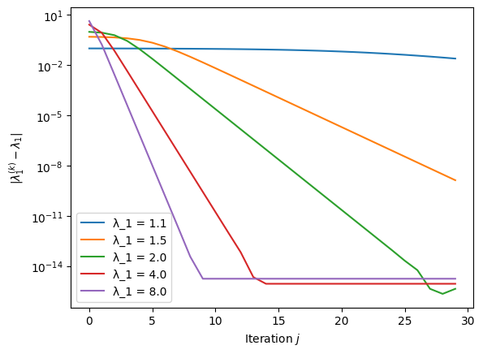
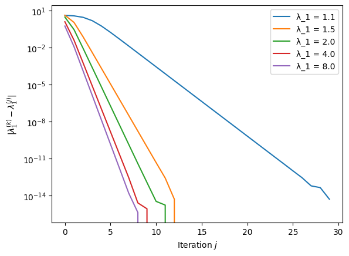
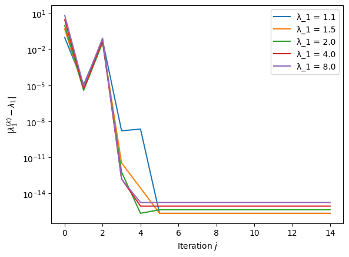
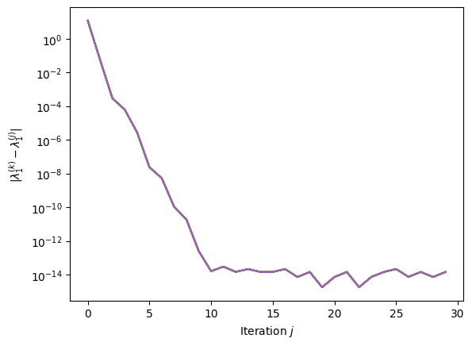
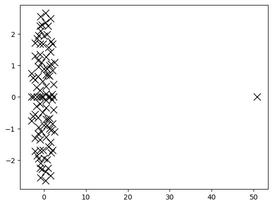
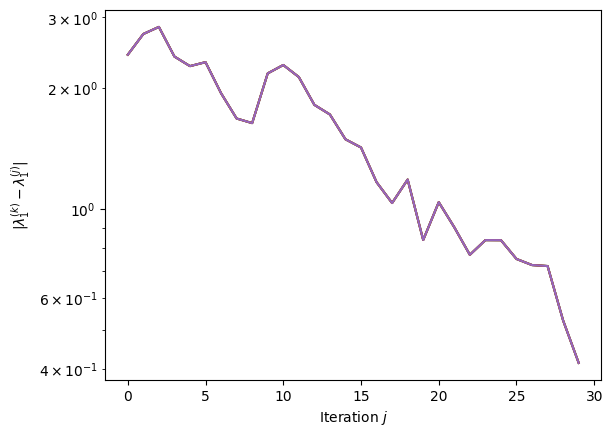

# Computing eigenvalues

From [Abel–Ruffini theorem](bm1_notation_and_facts.md), it follows that for equations involving polynomials of degree five or higher, one can't find a one-size-fits-all formula to solve them using just the basic arithmetic operations and root extractions. Since we can phrase the eigenvalue problem as finding the roots of the characteristic polynomial (and every polynomial is the characteristic polynomial of some matrix), we cannot generally compute eigenvalues in closed form for matrices with dimensions larger than 4. Hence, we need iterative methods to compute eigenvalues. The most fundamental method to compute eigenvalues is the power method.

## The power method

Let $A\in\mathbb{C}^{n\times n}$ be a given diagonalizable matrix and let $q^{(0)}$ be a starting vector with $\|q^{(0)}\|_2=1$   

```{prf:algorithm} Power Method

**Inputs** $A\in\mathbb{C}^{n\times n}$, $q^{(0)} \in\mathbb{C}^n$

**Outputs** $q^{(\infty)} \in\mathbb{C}^n$, $\lambda^{(\infty)} \in\mathbb{C}$

- For $k \in \mathbb{N} \setminus \{0\}$:
	- $z^{(k)} = Aq^{(k-1)}$
	- $q^{(k)} = z^{(k)}/\|z^{(k)}\|_2$
	- $\lambda^{(k)} = (q^{(k)})^HAq^{(k)}$
```
  
The analysis of the algorithm is very simple, with normalisation solely for numerical stability to prevent overflow. The crux lies in iterative vector multiplication. Assuming $A$ is diagonalizable with eigenpairs $(\lambda_j, x_j)$, the initial vector $q^{(0)}$ is expressed as a linear combination of eigenvectors, $q^{(0)} = \sum_{j}\alpha_jx_j$. This leads to:
  
$$  
A^{k}q^{(0)} = \sum_{j=1}^n\alpha_j\lambda_j^kx_j = \alpha_1\lambda_1^{k}\left(x_1+\sum_{j=2}^n\frac{\alpha_j}{\alpha_1}\left(\frac{\lambda_j}{\lambda_1}\right)^kx_j\right).  
$$  
  
Let $\lambda_1$ be the largest  (in absolute value) and $\lambda_2$ be the second-largest eigenvalue. Then, the power method successfully converges to the eigenvector $q_1$ associated with $\lambda_1$ when $|\lambda_1| > |\lambda_j|$, $j > 1$, with the convergence rate and error magnitude order given by $\mathcal{O}\bigl(\left|\lambda_2 / \lambda_1\right|^k\bigr)$.

The approximation of the eigenvalue relies on the perturbation result for $q^{(j)} = q_1 + \epsilon$

$$
(q_1 + \epsilon)^H A (q_1 + \epsilon) \to q_1^H A q_1 = \lambda_1 \| q_1 \|_2^2 = \lambda_1
$$

as $\| \epsilon \| \to 0$. We set

$$
R(A,x) := \frac{x^H A x}{x^H x},
$$

called the Rayleigh quotient of $A$ and $x$. In practice, one needs to terminate the `for` loop of the power iteration after a prescribed number of iterations or through some criterion indicating the quality of the eigenvalue or eigenvector approximation. In fact, $\lambda^{(k)} = (q^{(k)})^HAq^{(k)}$ may be taken out of the `for` loop and computed only with the final $q^{(k)}$.

`````{prf:example}
Consider the simple diagonal matrix

$$
A = I_n + (\lambda_1 - 1) \, e_1 \otimes e_1 = \text{diag}(\lambda_1, 1, \ldots, 1)
$$

for $\lambda_1 = 1.1, 1.5, 2.0, 4.0, 8.0$. The following plot verifies that the rate of convergence depends strongly on the ratio of the largest and second-largest eigenvalue.



````{dropdown} Python code
```python
import numpy as np
import matplotlib.pyplot as plt

def power_method(A, q0, k):
    """Evaluates k steps of the power iteration with starting vector q0 for the matrix A, returning a vector of eigenvalue iterates."""
    lambda_iterates = np.zeros(k, dtype=np.complex128)
    q = q0
    for i in range(k):
        z = A @ q  # Simplified matrix-vector multiplication
        q = z / np.linalg.norm(z)  # Normalizing q
        lambda_iterates[i] = np.vdot(q, A @ q)  # Using vdot for complex conjugate dot product

    return lambda_iterates

# Parameters and initial setup
n, k = 100, 100
A = np.identity(n)
q0 = np.ones(n) + 1j * np.ones(n)  # Complex starting vector

# Compute eigenvalues and plot
lambda_max =  [1.1, 1.5, 2.0, 4.0, 8.0]
s = len(lambda_max)
lambda_iterates = np.zeros((k,s), dtype=np.complex128)
for i in range(s):
  A[0,0] = lambda_max[i]
  lambda_iterates[:,i] = power_method(A, q0, k)
  plt.semilogy(np.abs(lambda_iterates[0:30,i] - lambda_iterates[-1,i]), label=f"λ_1 = {lambda_max[i]}")
plt.ylabel('$|\lambda_1^{(k)} - \lambda_1^{(j)}|$')
plt.xlabel('Iteration $j$')
plt.legend()
plt.show()
```
````
`````

## Inverse Iteration  
  
The principle idea of inverse iteration is to transform the spectrum of the matrix $A$ to accelerate the eigenvalue convergence.  
  
Let $Ax=\lambda x$. Then we have $(A-\sigma I)^{-1}x=(\lambda-\sigma)^{-1}x$. The biggest eigenvalue is now the one that is closest to $\sigma$, and we can expect that the power method to $(A-\sigma I)^{-1}$ in place of $A$ will converge fast to the eigenvalue close to $\sigma$.

```{prf:algorithm} Inverse Iteration

**Inputs** $A\in\mathbb{C}^{n\times n}$, $z^{(0)} \in\mathbb{C}^n$, $\sigma \in\mathbb{C}$

**Outputs** $q^{(\infty)} \in\mathbb{C}^n$, $\lambda^{(\infty)} \in\mathbb{C}$

- For $k \in \mathbb{N}$:
	- $q^{(k)} = z^{(k)}/\|z^{(k)}\|_2$
	- Solve $(A-\sigma I) z^{(k+1)} = q^{(k)}$
	- $\lambda^{(k+1)} = (q^{(k+1)})^HAq^{(k+1)}$
```

`````{prf:example}
We revisit the first example above and consider the matrix $A = \text{diag}(\lambda_1, 1, \ldots, 1)$ for $\lambda_1 = 1.1, 1.5, 2.0, 4.0, 8.0$. The following plot uses the inverse iteration with $\sigma = 1.1 \, \lambda_1$, illustrating a situation where the eigenvalue of interest is known within a 10% tolerance.



````{dropdown} Python code
```python
import numpy as np
import matplotlib.pyplot as plt
from scipy.linalg import lu, solve_triangular

def inverse_iteration(A, q0, sigma, k):
    lambda_iterates = np.zeros(k, dtype=np.complex128)
    n = A.shape[0]
    P, L, U = lu(A - sigma * np.eye(n, dtype=A.dtype))

    def applyMat(x):
        return solve_triangular(U, solve_triangular(L, np.dot(P, x), lower=True))
        
    z = applyMat(q0)
    for i in range(k):
        q = z / np.linalg.norm(z)
        z = applyMat(q)
        lambda_iterates[i] = np.dot(q.conj(), z)
    
    return lambda_iterates

# Parameters and initial setup
n, k = 100, 100
A = np.identity(n)
q0 = np.ones(n) + 1j * np.ones(n)  # Complex starting vector

# Compute eigenvalues and plot
lambda_max =  [1.1, 1.5, 2.0, 4.0, 8.0]
s = len(lambda_max)
lambda_iterates = np.zeros((k,s), dtype=np.complex128)
for i in range(s):
  A[0,0] = lambda_max[i]
  lambda_iterates[:,i] = inverse_iteration(A, q0, 1.1 * lambda_max[i], k)
  plt.semilogy(np.abs(lambda_iterates[0:30,i] - lambda_iterates[-1,i]), label=f"λ_1 = {lambda_max[i]}")
plt.ylabel('$|\lambda_1^{(k)} - \lambda_1^{(j)}|$')
plt.xlabel('Iteration $j$')
plt.legend()
plt.show()
```
````
`````

## Rayleigh quotient iteration  
  
One can combine the inverse iteration with evaluating the Rayleigh quotient. The idea is that instead of the fixed value $\sigma$ in each step, we use as a shift the value of the Rayleigh quotient. The resulting algorithm is called Rayleigh quotient iteration. For symmetric problems this approach is most effective: the convergence is even cubic.  

```{prf:algorithm} Rayleigh Quotient Iteration

**Inputs** $A\in\mathbb{C}^{n\times n}$, $z^{(0)} \in\mathbb{C}^n$, $\sigma \in\mathbb{C}$

**Outputs** $q^{(\infty)} \in\mathbb{C}^n$, $\lambda^{(\infty)} \in\mathbb{C}$

- $\lambda_\sigma^{(0)} = 0$
- For $k \in \mathbb{N}$:
	- $q^{(k)} = z^{(k)}/\|z^{(k)}\|_2$
	- Solve $(A-\lambda^{(k)} I) z^{(k+1)} = q^{(k)}$
	- $\lambda^{(k+1)} = (q^{(k+1)})^HAq^{(k+1)}$
```

`````{prf:example}
We revisit the example above and consider the matrix $A = \text{diag}(\lambda_1, 1, \ldots, 1)$ for $\lambda_1 = 1.1, 1.5, 2.0, 4.0, 8.0$. The following plot starts the inverse iteration with $\sigma = 1.1 \, \lambda_1$, illustrating a situation where the eigenvalue of interest is known within a 10% tolerance.



````{dropdown} Python code
```python
import numpy as np
import matplotlib.pyplot as plt

def rayleigh_quotient_iteration(A, z, sigma, k):
    lambda_iterates = np.zeros(k, dtype=np.complex128)
    n = A.shape[0]

    for i in range(k):
        q = z / np.linalg.norm(z)
        z = np.linalg.solve(A - sigma * np.eye(n, dtype=A.dtype), q)
        lambda_iterates[i] = np.vdot(q, A @ q)
        sigma = lambda_iterates[i]

    return lambda_iterates

# Parameters and initial setup
n, k = 100, 100
A = np.identity(n)
q0 = np.ones(n) + 1j * np.ones(n)  # Complex starting vector

# Compute eigenvalues and plot
lambda_max =  [1.1, 1.5, 2.0, 4.0, 8.0]
s = len(lambda_max)
lambda_iterates = np.zeros((k,s), dtype=np.complex128)
for i in range(s):
  A[0,0] = lambda_max[i]
  lambda_iterates[:,i] = rayleigh_quotient_iteration(A, q0, 1.1 * lambda_max[i], k)
  plt.semilogy(np.abs(lambda_iterates[0:30,i] - lambda_iterates[-1,i]), label=f"λ_1 = {lambda_max[i]}")
plt.ylabel('$|\lambda_1^{(k)} - \lambda_1^{(j)}|$')
plt.xlabel('Iteration $j$')
plt.legend()
plt.show()
```
````
`````

`````{admonition} Computational Investigation
:class: tip
We now investigate a more complex example with a random matrix whose entries are drawn from a uniform distribution on $[0,1]$



````{dropdown} Python code
```python
import numpy as np
import matplotlib.pyplot as plt

def power_method(A, q0, k):
    """Evaluates k steps of the power iteration with starting vector q0 for the matrix A, returning a vector of eigenvalue iterates."""
    lambda_iterates = np.zeros(k, dtype=np.complex128)
    q = q0
    for i in range(k):
        z = A @ q  # Simplified matrix-vector multiplication
        q = z / np.linalg.norm(z)  # Normalizing q
        lambda_iterates[i] = np.vdot(q, A @ q)  # Using vdot for complex conjugate dot product

    return lambda_iterates

# Parameters and initial setup
n, k = 100, 100
A = rand(n,n)
q0 = randn(n) + 1j * randn(n)

# Compute eigenvalues and plot
for i in range(s):
  lambda_iterates = power_method(A, q0, k)
  plt.semilogy(np.abs(lambda_iterates[0:30] - lambda_iterates[-1]))
plt.ylabel('$|\lambda_1^{(k)} - \lambda_1^{(j)}|$')
plt.xlabel('Iteration $j$')
plt.show()
```
````

The convergence is very fast. We have the first eigenvalue to machine precision in about ten iterations. Why the fast convergence? Let’s plot the eigenvalues of the matrix.



````{dropdown} Python code
```python
import scipy.linalg

eigvals = scipy.linalg.eigvals(A)
plt.plot(np.real(eigvals), np.imag(eigvals), 'kx',markersize=10)
```
````

The largest eigenvalue of a random matrix with entries uniformly distributed in $[0, 1]$ is typically around 50, distinct from the cluster of other eigenvalues near the origin. Replacing all matrix entries with their average value of $0.5$ results in a single eigenvalue of exactly $50$, with the corresponding eigenvector being $[1, \dots, 1]^T$. This illustrates how random matrices can exhibit surprisingly non-random behaviour.

If we replace $A$'s elements with normally distributed random numbers, all eigenvalues are clustered around $0$, and the power method won't exhibit good convergence.



````{dropdown} Python code
```python
import numpy as np
import matplotlib.pyplot as plt

def power_method(A, q0, k):
    """Evaluates k steps of the power iteration with starting vector q0 for the matrix A, returning a vector of eigenvalue iterates."""
    lambda_iterates = np.zeros(k, dtype=np.complex128)
    q = q0
    for i in range(k):
        z = A @ q  # Simplified matrix-vector multiplication
        q = z / np.linalg.norm(z)  # Normalizing q
        lambda_iterates[i] = np.vdot(q, A @ q)  # Using vdot for complex conjugate dot product

    return lambda_iterates

# Parameters and initial setup
n, k = 100, 100
A = A = randn(n,n)
q0 = randn(n) + 1j * randn(n)

# Compute eigenvalues and plot
for i in range(s):
  lambda_iterates = power_method(A, q0, k)
  plt.semilogy(np.abs(lambda_iterates[0:30] - lambda_iterates[-1]))
plt.ylabel('$|\lambda_1^{(k)} - \lambda_1^{(j)}|$')
plt.xlabel('Iteration $j$')
plt.show()
```
````

Thinking about the expected behaviours of numerical linear algebra algorithms for random matrices is useful because it allows us to predict the expected behaviour of the algorithms.
`````
