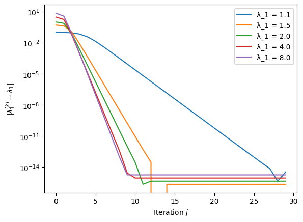
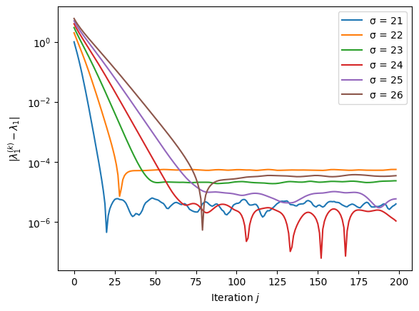
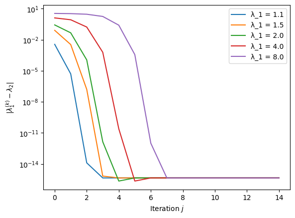

# Computing eigenvalues

From [Abel–Ruffini theorem](bm1_notation_and_facts.md), it follows that for equations involving polynomials of degree five or higher, one can't find a one-size-fits-all formula to solve them using just the basic arithmetic operations and root extractions. Since we can phrase the eigenvalue problem as finding the roots of the characteristic polynomial (and every polynomial is the characteristic polynomial of some matrix), we cannot generally compute eigenvalues in closed form for matrices with dimensions larger than 4. Hence, we need iterative methods to compute eigenvalues. The most fundamental method to compute eigenvalues is the power method.

## The power method

The task is to compute the largest eigenvalue of a given diagonalisable matrix $A\in\mathbb{C}^{n\times n}$.

```{prf:algorithm} Power Method

**Inputs** $A\in\mathbb{C}^{n\times n}$ diagonalisable, $z^{(0)} \in\mathbb{C}^n \setminus \{ 0 \}$

**Outputs** $\{q^{(k)}\}_{k \in \mathbb{N}} \subset \mathbb{C}^n$, $\{\lambda^{(k)}\}_{k \in \mathbb{N}} \subset \mathbb{C}$

- For $k \in \mathbb{N}$:
    - $q^{(k)} = z^{(k)}/\|z^{(k)}\|_2$
    - $\lambda^{(k)} = (q^{(k)})^HAq^{(k)}$
    - $z^{(k+1)} = A q^{(k)}$
```
  
The analysis of the algorithm is very simple. Assuming $A$ has the eigenpairs $(\lambda_j, x_j)$ with $\| x_j \|_2 =1$, the initial vector $q^{(0)}$ is expressed as a linear combination of eigenvectors, $q^{(0)} = \sum_{j}\alpha_jx_j$. If  $\alpha_1, \lambda_1 \neq 0$, this leads to:
  
$$  
A^{k} q^{(0)} = \sum_{j=1}^n\alpha_j\lambda_j^kx_j = \alpha_1\lambda_1^{k}\left(x_1+\sum_{j=2}^n\frac{\alpha_j}{\alpha_1}\left(\frac{\lambda_j}{\lambda_1}\right)^kx_j\right).  
$$  
  
Therefore, when $|\lambda_1| > |\lambda_j|$ for $j > 1$,

$$
q^{(k)} = \frac{A^{k} q^{(0)}}{\| A^{k} q^{(0)} \|} \to \frac{\alpha_1 \lambda_1^{k} x_1}{\| \alpha_1  \lambda_1^{k} x_1 \|} \qquad \text{as } k \to \infty.
$$

Consequently, with

$$
\tilde{q}^{(k)} := \frac{|\alpha_1|}{\alpha_1} \, \left( \frac{|\lambda_1|}{\lambda_1} \right)^k \, q^{(k)} \to x_1 \qquad \text{as } k \to \infty,
$$

the power method successfully converges to the eigenvector $x_1$  with the convergence rate and error magnitude order given by $\mathcal{O}\bigl(\left|\lambda_2 / \lambda_1\right|^k\bigr)$.

The approximation of the eigenvalue relies on the perturbation result for $\tilde{q}^{(k)} = x_1 + \epsilon$

$$
(x_1 + \epsilon)^H A (x_1 + \epsilon) \to x_1^H A x_1 = \lambda_1 \| x_1 \|_2^2 = \lambda_1
$$

as $\| \epsilon \| \to 0$. We set

$$
R(A,x) := \frac{x^H A x}{x^H x},
$$

called the *Rayleigh quotient* of $A$ and $x$. In practice, one needs to terminate the `for` loop of the power iteration after a prescribed number of iterations or through some criterion indicating the quality of the eigenvalue or eigenvector approximation. In fact, $\lambda^{(k)} = (q^{(k)})^HAq^{(k)}$ may be taken out of the `for` loop and computed only with the final $q^{(k)}$.

`````{prf:example}
Consider the simple diagonal matrix

$$
A = I_n + (\lambda_1 - 1) \, e_1 \otimes e_1 = \text{diag}(\lambda_1, 1, \ldots, 1)
$$

for $\lambda_1 = 1.1, 1.5, 2.0, 4.0, 8.0$. The following plot verifies that the rate of convergence depends strongly on the ratio of the largest and second-largest eigenvalue.


````{dropdown} Python code
```python
import numpy as np
import matplotlib.pyplot as plt

def power_method(A, z, k):
    """Evaluates k steps of the power iteration"""
    lambda_iterates = np.zeros(k, dtype=np.complex128)
    for i in range(k):
        q = z / np.linalg.norm(z)  # Normalizing q
        lambda_iterates[i] = np.vdot(q, A @ q)  # Using vdot for complex conjugate dot product
        z = A @ q  # Simplified matrix-vector multiplication
    return lambda_iterates

# Parameters and initial setup
n, k = 100, 30
A = np.identity(n)
z = np.ones(n) + 1j * np.ones(n)  # Complex starting vector

# Compute eigenvalues and plot
lambda_max =  [1.1, 1.5, 2.0, 4.0, 8.0]
s = len(lambda_max)
lambda_iterates = np.zeros((k,s), dtype=np.complex128)
for i in range(s):
  A[0,0] = lambda_max[i]
  lambda_iterates[:,i] = power_method(A, z, k)
  plt.semilogy(np.abs(lambda_iterates[:,i] - lambda_max[i]), label=f"λ_1 = {lambda_max[i]}")
plt.ylabel('$|\lambda_1^{(k)} - \lambda_1|$')
plt.xlabel('Iteration $j$')
plt.legend()
plt.show()
```
````
`````

`````{prf:example}
Consider the Wilkinson polynomial $P_n(z) = \prod_{j=1}^n (z-j)$ and its companion matrix $C_n$, $n \in \mathbb{N}$. Clearly, the eigenvalues of $C_n$ are $\{1, \ldots, n\}$. 


````{dropdown} Python code
```python
import numpy as np
import matplotlib.pyplot as plt
np.random.seed(1)

def power_method(A, z, k):
    """Evaluates k steps of the power iteration"""
    lambda_iterates = np.zeros(k, dtype=np.complex128)
    for i in range(k):
        q = z / np.linalg.norm(z)  # Normalizing q
        lambda_iterates[i] = np.vdot(q, A @ q)  # Using vdot for complex conjugate dot product
        z = A @ q  # Simplified matrix-vector multiplication
    return lambda_iterates

def companion_matrix(a):
    """Generate the companion matrix for a given polynomial represented by its coefficients."""
    # normalise the leading coefficient
    a = np.complex128(a)
    a = a / a[-1]
    n = len(a) - 1
    C = np.zeros((n, n), dtype=np.complex128)
    # Set the last column of C to be the negated coefficients (except the leading one)
    C[:, -1] = -np.array(a[:-1])
    # Set the subdiagonal elements to 1
    np.fill_diagonal(C[1:], 1)
    return C

def wilkinson_polynomial_coefficients(n):
    """Generate the coefficients of the Wilkinson polynomial of degree n"""
    def poly_multiply(poly1, poly2):
        """Multiply two polynomials represented as lists of coefficients."""
        result = [0] * (len(poly1) + len(poly2) - 1)
        for i, coef1 in enumerate(poly1):
            for j, coef2 in enumerate(poly2):
                result[i + j] += coef1 * coef2
        return result
    # Start with the polynomial x - 1
    poly = [1, -1]
    for i in range(2, n + 1):
    # Multiply the current polynomial by x - i using integer arithmetic
        poly = poly_multiply(poly, [1, -i])
    poly.reverse()
    return poly

# Compute eigenvalues and plot
k = 200
i_max = 5
lambda_iterates = np.zeros((k, i_max), dtype=np.complex128)
for i in range(1, i_max):
    # Parameters and initial setup
    n = 5 * i
    A = companion_matrix(wilkinson_polynomial_coefficients(n))
    z = np.random.rand(n) + 1j * np.ones(n)  # Complex starting vector
    lambda_iterates[:, i] = power_method(A, z, k)
    plt.semilogy(np.abs(lambda_iterates[1:, i] - n), label=f"n = {n}")
plt.ylabel('$|\lambda_1^{(k)} - \lambda_1|$')
plt.xlabel('Iteration $j$')
plt.legend()
plt.show()
```
````
`````

## Inverse Iteration  
  
The principal idea of inverse iteration is to transform the spectrum of the matrix $A$ to accelerate the convergence to eigenvalues.  
  
Let $A x=\lambda x$ and $\sigma \in \mathbb{C}$ not be an eigenvalue. Then we have $(A-\sigma I)^{-1}x=(\lambda-\sigma)^{-1}x$. The largest eigenvalue of $(A-\sigma I)^{-1}$ is the one that is closest to $\sigma$, and we can expect that the power method to $(A-\sigma I)^{-1}$ in place of $A$ will converge fast to the eigenvalue close to $\sigma$.

```{prf:algorithm} Inverse Iteration

**Inputs** $A\in\mathbb{C}^{n\times n}$ diagonalisable, $z^{(0)} \in\mathbb{C}^n \setminus \{ 0 \}$, $\sigma \in\mathbb{C}$ not eigenvalue of $A$

**Outputs** $\{q^{(k)}\}_{k \in \mathbb{N}} \subset \mathbb{C}^n$, $\{\lambda^{(k)}\}_{k \in \mathbb{N}} \subset \mathbb{C}$

- For $k \in \mathbb{N}$:
    - $q^{(k)} = z^{(k)}/\|z^{(k)}\|_2$
    - $\lambda^{(k)} = (q^{(k)})^HAq^{(k)}$
    - Solve $(A-\sigma I) z^{(k+1)} = q^{(k)}$
```

`````{prf:example}
We revisit the first example above and consider again the matrix $A = \text{diag}(\lambda_1, 1, \ldots, 1)$ for $\lambda_1$ and $n$ as above. The following plot uses the inverse iteration with $\sigma = 1.1 \, \lambda_1$, illustrating a situation where the eigenvalue of interest is known within a 10% tolerance.



````{dropdown} Python code
```python
import numpy as np  
import matplotlib.pyplot as plt  
from scipy.linalg import lu, solve_triangular  

def inverse_iteration(A, z, sigma, k):  
    lambda_iterates = np.zeros(k, dtype=np.complex128)  
    n = A.shape[0]  
    P, L, U = lu(A - sigma * np.eye(n, dtype=A.dtype))  
  
    def applyMat(x):  
        """Computes (A - sigma I)^{-1} x = (PLU)^{-1} x = U^{-1} L^{-1} P^T x"""  
        return solve_triangular(U, solve_triangular(L, np.dot(P, x), lower=True))  

    for i in range(k):  
        q = z / np.linalg.norm(z)  
        lambda_iterates[i] = np.vdot(q, A @ q)  
        z = applyMat(q)  # (A - sigma I)^{-1} q  
  
    return lambda_iterates  
   
# Parameters and initial setup  
n, k = 100, 30  
A = np.identity(n, dtype=np.complex128)  
z = np.ones(n) + 1j * np.ones(n)  # Complex starting vector  
  
# Compute eigenvalues and plot  
lambda_max = [1.1, 1.5, 2.0, 4.0, 8.0]  
s = len(lambda_max)  
lambda_iterates = np.zeros((k, s), dtype=np.complex128)  
for i in range(s):  
    A[0, 0] = lambda_max[i]  
    lambda_iterates[:, i] = inverse_iteration(A, z, 1.1 * lambda_max[i], k)  
    plt.semilogy(np.abs(lambda_iterates[:, i] - lambda_max[i]), label=f"λ_1 = {lambda_max[i]}")
plt.ylabel('$|\lambda_1^{(k)} - \lambda_1|$')  
plt.xlabel('Iteration $j$')  
plt.legend()  
plt.show()
```
````
`````

`````{prf:example}
In this example, we investigate how the choice of $\sigma$ impacts the performance of the inverse iteration. The matrix is the companion matrix of the Wilkinson polynomial for $n = 20$ and $\sigma = n+1, \ldots, n+6$.



````{dropdown} Python code
```python
import numpy as np
import matplotlib.pyplot as plt
np.random.seed(1)

def inverse_iteration(A, z, sigma, k):  
    lambda_iterates = np.zeros(k, dtype=np.complex128)  
    n = A.shape[0]  
    P, L, U = lu(A - sigma * np.eye(n, dtype=A.dtype))  
  
    def applyMat(x):  
        """Computes (A - sigma I)^{-1} x = (PLU)^{-1} x = U^{-1} L^{-1} P^T x"""  
        return solve_triangular(U, solve_triangular(L, np.dot(P, x), lower=True))  

    for i in range(k):  
        q = z / np.linalg.norm(z)  
        lambda_iterates[i] = np.vdot(q, A @ q)  
        z = applyMat(q)  # (A - sigma I)^{-1} q  
  
    return lambda_iterates 

def companion_matrix(a):
    """Generate the companion matrix for a given polynomial represented by its coefficients."""
    # normalise the leading coefficient
    a = np.complex128(a)
    a = a / a[-1]
    n = len(a) - 1
    C = np.zeros((n, n), dtype=np.complex128)
    # Set the last column of C to be the negated coefficients (except the leading one)
    C[:, -1] = -np.array(a[:-1])
    # Set the subdiagonal elements to 1
    np.fill_diagonal(C[1:], 1)
    return C

def wilkinson_polynomial_coefficients(n):
    """Generate the coefficients of the Wilkinson polynomial of degree n"""
    def poly_multiply(poly1, poly2):
        """Multiply two polynomials represented as lists of coefficients."""
        result = [0] * (len(poly1) + len(poly2) - 1)
        for i, coef1 in enumerate(poly1):
            for j, coef2 in enumerate(poly2):
                result[i + j] += coef1 * coef2
        return result
    # Start with the polynomial x - 1
    poly = [1, -1]
    for i in range(2, n + 1):
    # Multiply the current polynomial by x - i using integer arithmetic
        poly = poly_multiply(poly, [1, -i])
    poly.reverse()
    return poly

# Compute eigenvalues and plot
k = 200
n = 20
i_max = 7
lambda_iterates = np.zeros((k, i_max))
for i in range(1, i_max):
    # Parameters and initial setup
    A = companion_matrix(wilkinson_polynomial_coefficients(n))
    z = np.random.rand(n) + 1j * np.ones(n)  # Complex starting vector
    lambda_iterates[:, i] = inverse_iteration(A, z, n + i, k)
    plt.semilogy(np.abs(lambda_iterates[1:, i] - n), label=f"σ = {n + i}")
plt.ylabel('$|\lambda_1^{(k)} - \lambda_1|$')
plt.xlabel('Iteration $j$')
plt.legend()
plt.show()
```
````

Note the scale of the vertical axis. While the convergence is rapid with a good choice of $\sigma$, it is apparent that rounding errors and stability issues are more pronounced than in the case of the power iteration where convergence to an error below $10^{-12}$ occurs.

`````

## Rayleigh quotient iteration  
  
One can combine the inverse iteration with evaluating the Rayleigh quotient. The idea is that instead of the fixed value $\sigma$ in each step, we use as a shift the value of the Rayleigh quotient. The resulting algorithm is called Rayleigh quotient iteration. For symmetric problems, this approach is most effective: the convergence is even cubic.  

```{prf:algorithm} Rayleigh Quotient Iteration

**Inputs** $A\in\mathbb{C}^{n\times n}$ diagonalisable, $z^{(0)} \in\mathbb{C}^n \setminus \{ 0 \}$, $\sigma \in\mathbb{C}$ not eigenvalue of $A$

**Outputs** $\{q^{(k)}\}_{k \in \mathbb{N}} \subset \mathbb{C}^n$, $\{\lambda^{(k)}\}_{k \in \mathbb{N}} \subset \mathbb{C}$

- $q^{(0)} = z^{(0)}/\|z^{(0)}\|_2$
- $\lambda^{(0)} = \sigma$
- For $k \in \mathbb{N} \setminus \{ 0 \}$:
    - Solve $(A-\lambda^{(k-1)} I) z^{(k)} = q^{(k-1)}$
    - $q^{(k)} = z^{(k)}/\|z^{(k)}\|_2$
    - $\lambda^{(k)} = (q^{(k)})^HAq^{(k)}$
```

While for the inverse iteration, the LU or QR decomposition of $A - \sigma I$ only needs to be computed once, the Rayleigh quotient iteration requires a new decomposition in each iteration or an algorithm for the solution of linear systems that does not rely on a matrix decomposition.

`````{prf:example}
We revisit the example with the matrix $A = \text{diag}(\lambda_1, 1, \ldots, 1)$ for $\lambda_1 = 1.1, 1.5, 2.0, 4.0, 8.0$ and $n = 100$ once more. The following plot starts the Rayleigh iteration with $\sigma = 1.01 \, \lambda_1$, illustrating a situation where a *very* good estimate of the eigenvalue of interest is known.


The convergence is rapid. However, with an initial $\sigma = 1.1 \, \lambda_1$ convergence happens instead to $\lambda_2 = 1$, i.e. not the largest eigenvalue.



The problem can be addressed by rejecting updates of $\sigma$, which differ too significantly from the previous estimate.
```python
def rayleigh_quotient_iteration(A, z, sigma, k):
    lambda_iterates = np.zeros(k, dtype=np.complex128)
    n = A.shape[0]

    lambda_iterates[0] = sigma
    q = z / np.linalg.norm(z)
    for i in range(k):
        try:  # check if system singular or has extremely large condition number
            z = np.linalg.solve(A - sigma * np.eye(n, dtype=np.complex128), q)
        except:
            break
        q = z / np.linalg.norm(z)
        lambda_iterates[i] = np.vdot(q, A @ q)
        if np.abs(lambda_iterates[i] - sigma) < 0.1 * sigma:
            sigma = lambda_iterates[i]

    return lambda_iterates
```

With the line `if np.abs(lambda_iterates[i] - sigma) < 0.1 * sigma:`, it is ensured that $\sigma$ is only modified if the change is by less than 10\%. The `try` and `except` structure allows the execution of the code within the `try` block and in case of an (almost) singular $A - \sigma I$, to break the `for` loop without terminating the entire code execution. The `break` keyword ends the `for` (or `while`) loop. The resulting method still converges fast with an initial guess $\sigma = 1.1 \, \lambda_1$ -- understanding convergence as reaching nearly machine accuracy.


Clearly, the stability and convergence analysis of the Rayleigh quotient iteration deserves attention.

````{dropdown} Python code
```python
import matplotlib.pyplot as plt
import numpy as np

def rayleigh_quotient_iteration(A, z, sigma, k):
    lambda_iterates = np.zeros(k, dtype=np.complex128)
    n = A.shape[0]

    q = z / np.linalg.norm(z)
    lambda_iterates[0] = sigma
    for i in range(k):
        try:  # check if system singular or has extremely large condition number
            z = np.linalg.solve(A - sigma * np.eye(n, dtype=np.complex128), q)
        except:
            break
        q = z / np.linalg.norm(z)
        lambda_iterates[i] = np.vdot(q, A @ q)
        if np.abs(lambda_iterates[i] - sigma) < 0.1 * sigma:
            sigma = lambda_iterates[i]

    return lambda_iterates

# Parameters and initial setup
n, k = 100, 15
A = np.identity(n, dtype=np.complex128)
z = np.ones(n) + 1j * np.ones(n)  # Complex starting vector

# Compute eigenvalues and plot
lambda_max = [1.1, 1.5, 2.0, 4.0, 8.0]
s = len(lambda_max)
lambda_iterates = np.zeros((k, s), dtype=np.complex128)
for i in range(s):
    A[0, 0] = lambda_max[i]
    lambda_iterates[:, i] = rayleigh_quotient_iteration(A, z, 1.1 * lambda_max[i], k)
    plt.semilogy(np.abs(lambda_iterates[:, i] - lambda_max[i]), label=f"λ_1 = {lambda_max[i]}")
    print(lambda_iterates[-1, i])
plt.ylabel('$|\lambda_1^{(k)} - \lambda_1|$')
plt.xlabel('Iteration $j$')
plt.legend()
plt.show()
```
````
`````

## Python skills

The following code implements the three methods and applies them to the matrix $A = \text{diag}(1, 2, \ldots, 100)$.

```python
import matplotlib.pyplot as plt  
import numpy as np  
from scipy.linalg import lu, solve_triangular  
  
def power_method(A, z, k):  
    lambda_iterates = np.zeros(k, dtype=np.complex128)  
    for i in range(k):  
        q = z / np.linalg.norm(z)  
        lambda_iterates[i] = np.vdot(q, A @ q)  
        z = A @ q  
    return lambda_iterates  
  
def inverse_iteration(A, z, sigma, k):  
    lambda_iterates = np.zeros(k, dtype=np.complex128)  
    n = A.shape[0]  
    P, L, U = lu(A - sigma * np.eye(n, dtype=A.dtype))  
  
    def applyMat(x):  
        """Computes (A - sigma I)^{-1} x = (PLU)^{-1} x = U^{-1} L^{-1} P^T x"""  
        return solve_triangular(U, solve_triangular(L, np.dot(P, x), lower=True))  
  
    for i in range(k):  
        q = z / np.linalg.norm(z)  
        lambda_iterates[i] = np.vdot(q, A @ q)  
        z = applyMat(q)  # (A - sigma I)^{-1} q    
    return lambda_iterates  
  
def rayleigh_quotient_iteration(A, z, sigma, k):  
    lambda_iterates = np.zeros(k, dtype=np.complex128)  
    n = A.shape[0]  
    q = z / np.linalg.norm(z)  
    lambda_iterates[0] = sigma  
    for i in range(k):  
        try:  
            z = np.linalg.solve(A - sigma * np.eye(n, dtype=np.complex128), q)  
        except:  
            break  
        q = z / np.linalg.norm(z)  
        lambda_iterates[i] = np.vdot(q, A @ q)  
        if np.abs(lambda_iterates[i] - sigma) < 0.001 * sigma:  
            sigma = lambda_iterates[i]  
        else:  
            sigma = (1.0 + 0.001 * np.sign(lambda_iterates[i] - sigma)) * sigma  
    return lambda_iterates  
  
# Parameters and initial setup  
n, k = 100, 400  
A = np.diag(1.0 + np.arange(n, dtype=np.complex128))  
z = np.ones(n)  
  
# Compute eigenvalues and plot  
lambda_iterates = np.zeros((k, 3), dtype=np.complex128)  
lambda_iterates[:, 0] = power_method(A, z, k)  
lambda_iterates[:, 1] = inverse_iteration(A, z, 1.8 * n, k)  
lambda_iterates[:, 2] = rayleigh_quotient_iteration(A, z, 1.8 * n, k)  
plt.semilogy(np.abs(lambda_iterates[:, 0] - n), label=f"Power")  
plt.semilogy(np.abs(lambda_iterates[:, 1] - n), label=f"Inverse")  
plt.semilogy(np.abs(lambda_iterates[:, 2] - n), label=f"Rayleigh")  
print(lambda_iterates[-1, 0])  
print(lambda_iterates[-1, 1])  
print(lambda_iterates[-1, 2])  
plt.ylabel('$|\lambda_1^{(k)} - \lambda_1|$')  
plt.xlabel('Iteration $j$')  
plt.legend()  
plt.show()
```

The resulting plot is


## Self-check questions

````{admonition} **Question**
:class: tip

Consider a symmetric matrix $A$ defined as follows:

$$
A = \begin{pmatrix} 3 & 2 \\ 2 & 6 \end{pmatrix}
$$

The eigenvalues of $A$ are $\lambda_1 = 7$ and $\lambda_2 = 2$. The following code computes the power iteration to find the largest eigenvalue.
 
```python
import numpy as np

def power_method(A, z, k):
    lambda_iterates = np.zeros(k, dtype=np.complex128)
    for i in range(k):
        q = z / np.linalg.norm(z)
        lambda_iterates[i] = np.vdot(q, A @ q)
        z = A @ q
    return lambda_iterates

A = np.array([[3, 2], [2, 6]])
z = np.array([2, -1])

print(power_method(A, z, 20))
```

The output of the code is

```python
[2.+0.j 2.+0.j 2.+0.j 2.+0.j 2.+0.j 2.+0.j 2.+0.j 2.+0.j 2.+0.j 2.+0.j
 2.+0.j 2.+0.j 2.+0.j 2.+0.j 2.+0.j 2.+0.j 2.+0.j 2.+0.j 2.+0.j 2.+0.j]
```

Explain why the Rayleigh quotients of the power iteration do not converge to $7$.
````

```{dropdown} **Answer**
The start vector $z^{(0)}$ of the power iteration is an eigenvector of $\lambda_2$. Therefore, in each iteration of the `for` loop, the computations yield 

$$
\begin{align*}
q^{(k)} & \gets z^{(k)} / \| z^{(k)} \| = [2, -1]^\top / \sqrt{5},\\
\lambda^{(k)} & \gets (q^{(k)})^\top \, A \, q^{(k)} = 2,\\
z^{(k+1)} & \gets A \cdot q^{(k)} = 2 \, q^{(k)} = 2 \, [2, -1]^\top / \sqrt{5}.
\end{align*}
$$

More generally, the exercise illustrates the following: Suppose $A$ has a basis of eigenvectors $x_1, \ldots, x_n$, ordered by the magnitude of the respective eigenvalues. Then, for the power iteration to converge to $x_1$, it is necessary that $\alpha_1 \neq 0$ in the linear combination 

$$
q^{(0)} = \sum_{j = 1}^n \alpha_j \, x_j.
$$
```

```{admonition} **Question**
:class: tip
Suppose $A$ has a basis of orthonormal eigenvectors $x_1, \ldots, x_n$, ordered by the magnitude of the respective eigenvalues $\lambda_i$. Suppose that $\alpha_j \neq 0$ in the linear combination 

$$
q^{(0)} = \sum_{j = 1}^n \alpha_j x_j
$$

of the start vector $q^{(0)}$ of the power iteration. Also, suppose the eigenvalue $\lambda_1$ is simple.

Explain why the power iteration, when applied to $A - \lambda_1 x_1^\top x_1$, generates a sequence of Rayleigh quotients that converge to $\lambda_2$, not $\lambda_1$.
```

```{dropdown} **Answer**
The power iteration yields

$$
(A - \lambda_1 x_1^\top x_1)^k q^{(0)} = (\alpha_1\lambda_1^k x_1 - \alpha_1\lambda_1^k x_1) + \sum_{j=2}^n\alpha_j\lambda_j^k x_j = \alpha_2\lambda_2^k \left(x_2+\sum_{j \geq 3}\frac{\alpha_j}{\alpha_2}\left(\frac{\lambda_j}{\lambda_2}\right)^k x_j\right).
$$

Therefore, it follows that 

$$
\frac{|\alpha_2|}{\alpha_2} \, \left( \frac{|\lambda_2|}{\lambda_2} \right)^k  q^{(k)} \to x_2
$$

as $k \to \infty$, while the Rayleigh coefficient converges to $\lambda_2$.
```
